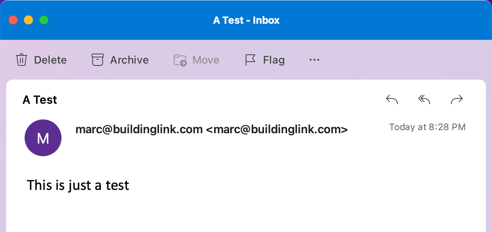

<style>
h1 {font-size: 30pt;margin-top:0px;}
h2 {font-size: 20pt;}
h3 {font-size: 24pt;margin-top:2em;}
ul, li, p {font-size:22pt;margin-bottom:24px;}
</style>

# SMTP

## The Simple Mail Transfer Protocol (SMTP)


an internet standard communication protocol for electronic mail transmission. 

---

# SMTP 

## a buildinglink foundational service

* Mail servers and other MTAs use SMTP to send and receive mail messages.

* Email clients use SMTP for sending messages to a mail server for **relaying**.

* SMTP relay allows the transmission of email messages from one server to another. (think; passing the baton).

  * domain reputation, ip reputation

  * large volumes of emails

  * horozontal scalability

---
<style scoped>
   img { margin-left:222px; margin-top: -100px;}
</style>

# Basic SMTP

```bash
telnet 
```
![height:740px][Fig1]

---
<style scoped>
p {font-size:20pt;}
</style>

# Mail Servers, MTA's and Exim4

A mail server can have many names: mail relay, mail router, internet mailer and mail transfer agent (MTA).
  
MTA's accept emails sent from mail user agents, query the MX records and select a mail server to transfer emails and send auto-response messages if an email has failed to reach the destination

Exim4 is an open source, highly configurable MTA and has features that are lacking in other MTA's specifically around enforcing diverse mail policies.

---

# Implementation Plan 

![width:850px][FIG2]

---
<style scoped>
  img {margin-left:240px;margin-top:-200px;}
</style>

# A Quick Test with telnet

```bash
telnet 127.0.0.1 25 <<EOF  
HELO 1
MAIL FROM: marc@buildinglink.com
RCPT TO: codemarc@gmail.com
DATA
Subject: A Test
This is just a test
.
QUIT
EOF
```



---
<style scoped>
h2{
  font-size: 16pt;
  color: red;
  margin-top:-2px;
}
code {
  margin-top:-29px;
  font-size: 13pt;
  color: black;
  background:#ffffff;
  border: 1px solid black;
}
</style>

# SMTP - Resource Reservations

## http://vault.buildinglink.local/reservations/smtp  (on vpn)

```json
{
  name: "smtp",                                           // reservation name
  group: "email",                                         // rancher project
  type: "bfs",                                            // bfs | bms | brs | other
  description: "A scalable mail transfer agent",          // a simple description
  port: 25,                                               // a port reservation
  team: "Rome",                                           // origin content
  requestor: "Karam",                                     // who1
  reviewer: "Marc",                                       // who2
  date: "11/10/2021",                                     // creation date
  updated: "11/17/2021",                                  // last updated
  documents: [ "https://github.com/BuildingLink/SMTP/blob/master/README.md" ],
  estates:   [ "rancher-dev","rancher-uat","rancher-prod-pdc","rancher-prod-azure" ],
  azrg: [ ],                                              // azure resource group name
  monitors: [ "k8nri"],                                   // monitor list
  health: [ "node", "health"],                            // health invocation
  pipeline: [ ],                                          // build
  rmq: [ ],                                               // rabbit queue names
  data: [ ],                                              // datastores
  ep: [                                                   // endpoints
    "tcp:smtprelay-dev.buildinglink.local",
    "tcp:smtprelay-uat.buildinglink.local",
    "tcp:smtprelay-pdc.buildinglink.local",
    "tcp:smtprelay-azure.buildinglink.local"
  ]
}
```

---
<style scoped>
h3 {
  font-size: 14pt;
  margin-top:2px;
}
ul {
  font-size: 14pt;
  margin-top:0px;
}
code {
  font-size: 13pt;
  color: black;
  background:#ffffff;
  border: 1px solid black;
  margin-top: -12px;
  margin-bottom: -12px;
}
</style>

# Standup a local cluster

## Using Rancher Desktop ([fresh install][T1] / factory reset)

### v0.6.1 k8s (v1.17.6 our rancher rke version)

```bash
# bin/1-login.sh - make sure you are in the vpn
export lookup=http://vault.buildinglink.local/accounts/GITHUB2
export valu=$(curl -s --retry-connrefused --retry-delay 2 "$lookup" | jq '.user' | tr -d '"')
export valp=$(curl -s --retry-connrefused --retry-delay 2 "$lookup" | jq '.pat' | tr -d '"')
echo $valp | nerdctl login -u $valu --password-stdin ghcr.io
Login Succeeded

# bin/2-pull.sh
nerdctl -n k8s.io pull ghcr.io/buildinglink/baseline:latest

# build smtp...
kim build -t "ghcr.io/buildinglink/email/smtp:latest" .

# show me the money
nerdctl -n k8s.io images | grep ghcr  

ghcr.io/buildinglink/baseline      latest         ad119652b0bf    About a minute ago    186.4 MiB
ghcr.io/buildinglink/email/smtp    latest         f012db0bd478    37 seconds ago        0.0 B

```

---
<!-- REFERENCES -->
[//]: https://marp.app/
[//]: https://unpkg.com/mermaid@0.5.2/exdoc/index.html
[//]: https://postmarkapp.com/blog/smtp-relay-services
[//]: https://kubernetes.io/docs/reference/generated/kubectl/kubectl-commands
[T1]: https://github.com/rancher-sandbox/rancher-desktop/releases

[Fig1]:https://mermaid.ink/img/eyJjb2RlIjoiXG5zZXF1ZW5jZURpYWdyYW1cbiAgICBhdXRvbnVtYmVyXG4gICAgU01UUCBDbGllbnQtPj4rU01UUCBTZXJ2ZXI6IEhFTE9cbiAgICBTTVRQIFNlcnZlci0tPj4tU01UUCBDbGllbnQ6IDI1MCBPS1xuICAgIFNNVFAgQ2xpZW50LT4-K1NNVFAgU2VydmVyOk1BSUwgRlJPTTogcm9tZUBidWlsZGluZ2xpbmsuY29tXG4gICAgU01UUCBTZXJ2ZXItLT4-LVNNVFAgQ2xpZW50OiAyNTAgT0tcbiAgICBTTVRQIENsaWVudC0-PitTTVRQIFNlcnZlcjpSQ1BUIFRPOiBtaW50Z3JlZW5idWdAZ21haWwuY29tXG4gICAgU01UUCBTZXJ2ZXItLT4-LVNNVFAgQ2xpZW50OiAyNTAgT0tcbiAgICBTTVRQIENsaWVudC0-PitTTVRQIFNlcnZlcjpEQVRBXG4gICAgU01UUCBTZXJ2ZXItLT4-LVNNVFAgQ2xpZW50OiAzNTRcbiAgICBOb3RlIG92ZXIgU01UUCBTZXJ2ZXI6IEVuZCBvZiBNZXNzYWdlIENvbnRlbnRcbiAgICBTTVRQIENsaWVudC0-PitTTVRQIFNlcnZlcjogO1xuICAgIFNNVFAgU2VydmVyLS0-Pi1TTVRQIENsaWVudDogMjUwIE9LXG4gICAgU01UUCBDbGllbnQtPj4rU01UUCBTZXJ2ZXI6UVVJVFxuICAgIFNNVFAgU2VydmVyLS0-Pi1TTVRQIENsaWVudDogMjIxXG5cbiIsIm1lcm1haWQiOnsidGhlbWUiOiJkZWZhdWx0In0sInVwZGF0ZUVkaXRvciI6dHJ1ZSwiYXV0b1N5bmMiOmZhbHNlLCJ1cGRhdGVEaWFncmFtIjpmYWxzZX0

[Fig1E]:https://mermaid-js.github.io/mermaid-live-editor/edit#eyJjb2RlIjoiXG5zZXF1ZW5jZURpYWdyYW1cbiAgICBhdXRvbnVtYmVyXG4gICAgU01UUCBDbGllbnQtPj4rU01UUCBTZXJ2ZXI6IEhFTE9cbiAgICBTTVRQIFNlcnZlci0tPj4tU01UUCBDbGllbnQ6IDI1MCBPS1xuICAgIFNNVFAgQ2xpZW50LT4-K1NNVFAgU2VydmVyOk1BSUwgRlJPTTogcm9tZUBidWlsZGluZ2xpbmsuY29tXG4gICAgU01UUCBTZXJ2ZXItLT4-LVNNVFAgQ2xpZW50OiAyNTAgT0tcbiAgICBTTVRQIENsaWVudC0-PitTTVRQIFNlcnZlcjpSQ1BUIFRPOiBtaW50Z3JlZW5idWdAZ21haWwuY29tXG4gICAgU01UUCBTZXJ2ZXItLT4-LVNNVFAgQ2xpZW50OiAyNTAgT0tcbiAgICBTTVRQIENsaWVudC0-PitTTVRQIFNlcnZlcjpEQVRBXG4gICAgU01UUCBTZXJ2ZXItLT4-LVNNVFAgQ2xpZW50OiAzNTRcbiAgICBOb3RlIG92ZXIgU01UUCBTZXJ2ZXI6IEVuZCBvZiBNZXNzYWdlIENvbnRlbnRcbiAgICBTTVRQIENsaWVudC0-PitTTVRQIFNlcnZlcjogO1xuICAgIFNNVFAgU2VydmVyLS0-Pi1TTVRQIENsaWVudDogMjUwIE9LXG4gICAgU01UUCBDbGllbnQtPj4rU01UUCBTZXJ2ZXI6UVVJVFxuICAgIFNNVFAgU2VydmVyLS0-Pi1TTVRQIENsaWVudDogMjIxXG5cbiIsIm1lcm1haWQiOiJ7XG4gIFwidGhlbWVcIjogXCJkZWZhdWx0XCJcbn0iLCJ1cGRhdGVFZGl0b3IiOnRydWUsImF1dG9TeW5jIjpmYWxzZSwidXBkYXRlRGlhZ3JhbSI6ZmFsc2V9

[FIG2]:https://mermaid.ink/img/eyJjb2RlIjoiZ3JhcGggTFJcbiAgICBzdWJncmFwaCBmNSBMb2NhbCBUcmFmZmljIE1hbmFnZXI6UHJpbWFyeSBEYXRhIENlbnRlclxuICAgICAgICBzbXRwcmVsYXktcGRjLmJ1aWxkaW5nbGluay5sb2NhbCAtLT4gVmlydHVhbC1TZXJ2ZXJcbiAgICAgICAgVmlydHVhbC1TZXJ2ZXIgLS0-IEs4OlBvb2xbUG9vbDxici8-SGVhbHRoIENoZWNrPGJyLz5IdHRwIExpdmVsaW5lc3NdXG4gICAgZW5kXG4gICAgc3ViZ3JhcGggcmFuY2hlci5idWlsZGluZ2xpbmsuY29tOmxvY2FsIGNsdXN0ZXJcbiAgICAgICAgSzg6UG9vbCAtLSBIb3N0UG9ydDoyNSAtLT4gTm9kZTE6W25vZGUgMTAuMS40MC42MDxici8-ZW1haWwvc210cDoxLjAuMDxici8-YmFzZWQgb24gZXhpbTRdXG4gICAgICAgIEs4OlBvb2wgLS0gSG9zdFBvcnQ6MjUgLS0-IE5vZGUyOltub2RlIDEwLjEuNDAuNjE8YnIvPmVtYWlsL3NtdHA6MS4wLjA8YnIvPmJhc2VkIG9uIGV4aW00XVxuICAgICAgICBLODpQb29sIC0tIEhvc3RQb3J0OjI1IC0tPiBOb2RlMzpbbm9kZSAxMC4xLjQwLjYyPGJyLz5lbWFpbC9zbXRwOjEuMC4wPGJyLz5iYXNlZCBvbiBleGltNF1cbiAgICAgICAgY206W2NvbmZpZ21hcCAtPiBlbnYsIDxici8-c2VjcmV0IC0-IC9ldGMvZXhpbTQvcGFzc3dkLmNsaWVudF1cbiAgICAgICAgXG4gICAgZW5kXG4iLCJtZXJtYWlkIjp7InRoZW1lIjoiZGVmYXVsdCJ9LCJ1cGRhdGVFZGl0b3IiOmZhbHNlLCJhdXRvU3luYyI6dHJ1ZSwidXBkYXRlRGlhZ3JhbSI6ZmFsc2V9

[FIG2E]:https://mermaid.live/edit/#eyJjb2RlIjoiZ3JhcGggTFJcbiAgICBzdWJncmFwaCBmNSBMb2NhbCBUcmFmZmljIE1hbmFnZXI6UHJpbWFyeSBEYXRhIENlbnRlclxuICAgICAgICBzbXRwcmVsYXktcGRjLmJ1aWxkaW5nbGluay5sb2NhbCAtLT4gVmlydHVhbC1TZXJ2ZXJcbiAgICAgICAgVmlydHVhbC1TZXJ2ZXIgLS0-IEs4OlBvb2xbUG9vbDxici8-SGVhbHRoIENoZWNrPGJyLz5IdHRwIExpdmVsaW5lc3NdXG4gICAgZW5kXG4gICAgc3ViZ3JhcGggcmFuY2hlci5idWlsZGluZ2xpbmsuY29tOmxvY2FsIGNsdXN0ZXJcbiAgICAgICAgSzg6UG9vbCAtLSBIb3N0UG9ydDoyNSAtLT4gTm9kZTE6W25vZGUgMTAuMS40MC42MDxici8-ZW1haWwvc210cDoxLjAuMDxici8-YmFzZWQgb24gZXhpbTRdXG4gICAgICAgIEs4OlBvb2wgLS0gSG9zdFBvcnQ6MjUgLS0-IE5vZGUyOltub2RlIDEwLjEuNDAuNjE8YnIvPmVtYWlsL3NtdHA6MS4wLjA8YnIvPmJhc2VkIG9uIGV4aW00XVxuICAgICAgICBLODpQb29sIC0tIEhvc3RQb3J0OjI1IC0tPiBOb2RlMzpbbm9kZSAxMC4xLjQwLjYyPGJyLz5lbWFpbC9zbXRwOjEuMC4wPGJyLz5iYXNlZCBvbiBleGltNF1cbiAgICAgICAgY206W2NvbmZpZ21hcCAtPiBlbnYsIDxici8-c2VjcmV0IC0-IC9ldGMvZXhpbTQvcGFzc3dkLmNsaWVudF1cbiAgICAgICAgXG4gICAgZW5kXG4iLCJtZXJtYWlkIjoie1xuICBcInRoZW1lXCI6IFwiZGVmYXVsdFwiXG59IiwidXBkYXRlRWRpdG9yIjpmYWxzZSwiYXV0b1N5bmMiOnRydWUsInVwZGF0ZURpYWdyYW0iOmZhbHNlfQ